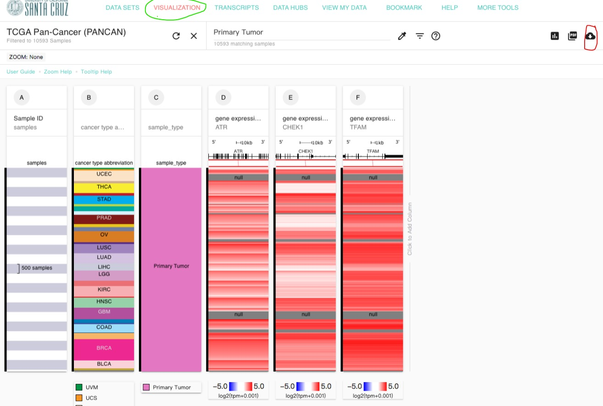

今天一大早（其实快10点了）还在睡觉，李老师问我想知道几个基因在几个TCGA癌症中的相关性。


其实这个问题是很好解决的，我们只要有各种基因在各种癌症的表达量就可以了，然后就是一个相关性分析，图的话就是一个散点图，excel都能做。

可以在线做相关性分析的网址很多，比如xena、ualcan、gepia（官网上的介绍上用非log归一化进行计算，用log归一化进行可视化，好奇怪的设定）、linkedomics、hiplot的在线ucsc-xena-shiny等等，这里我还是推荐xena的可视化分析去提取需要的数据，而且还能下载到本地，自主分析。

对于基因的表达量，以前有count、fpkm和tpm等多种单位，这里推荐用tpm。xena里有一个TCGA Pan-Cancer的数据集，里面有各种基因表达单位，这里推荐用[TOIL RSEM tpm](https://xenabrowser.net/datapages/?dataset=tcga_RSEM_gene_tpm&host=https%3A%2F%2Ftoil.xenahubs.net&removeHub=https%3A%2F%2Fxena.treehouse.gi.ucsc.edu%3A443)格式，不过单位是**log2(tpm+0.001)**，我们可以转换成tpm，也可以转换成log2(tpm+1)，具体什么格式按需转换。

按照需求，我花了几分钟时间就统计好了，顺便写个教程描述一下。

------------------------------------------------------------------------

## 数据的下载

首先从[xena](https://xenabrowser.net/heatmap/)的**VISUALIZATION**界面下载数据，选择**TCGA Pan-Cancer (PANCAN)**数据集，然后逐渐添加列

-   在Phenotypic里选择cancer type abbreviation（用于筛选肿瘤类型）

-   在Phenotypic里选择sample_type（用于筛选肿瘤组织）

-   在Genomic里输入ATR，基因类型（**gene expression RNAseq**）选择**TOIL RSEM tpm**（单位为log2tpm+0.001）

-   在Genomic里输入CHEK1，基因类型（**gene expression RNAseq**）选择**TOIL RSEM tpm**（单位为log2tpm+0.001）

-   在Genomic里输入TFAM，基因类型（**gene expression RNAseq**）选择**TOIL RSEM tpm**（单位为log2tpm+0.001）

全部选完以后一定记得先筛选一下**Primary Tumor**，同时去除所有的null值后再下载**tsv**文件，这样选择可以过滤掉非原发性肿瘤的患者。



## 数据预处理

由于下载的数据包括所有癌症类型，我们需要首先提取三种基因在四种癌症的数据。

### Excel的处理

导出的tsv格式里包含里所有的肿瘤类型，用Excel筛选肿瘤缩写（cancer type abbreviation）种的COAD、OV，PAAD和UCEC，由于下载后的基因名为Ensembl ID格式，需要重命名为symbol格式后另存为need.csv后导入R。

```
need<-read.csv("~/need.csv)
```

### R的处理

```         
data<-read.delim("~/denseDataOnlyDownload.tsv") #加载数据
colnames(data)[5:7]<-c('ATR','CHEK1','TFAM') #重命名基因名
need <- subset(data, cancer.type.abbreviation %in% c('COAD','OV','PAAD','UCEC')) # 提取特定肿瘤
```


## 相关性分析

建议使用**ggstatsplot**包进行统计并绘图，由于有四个肿瘤类型，这里也可以一次性计算，用`grouped_ggscatterstats()`函数实现分面效果。

### 计算ATR和TFAM在四种癌症的相关性

先用默认函数计算一下，这里默认的**pearson**法，先大致看一下效果，见图 cor1


```r
library(ggstatsplot)
grouped_ggscatterstats(need,#数据名
                       ATR,TFAM, #第一个是x轴，第二个是y轴
                       grouping.var = cancer.type.abbreviation,#按type分组
                       plotgrid.args = c(ncol=2) #分面函数，我们只显示两列
                       ) 
```

<div class="figure" style="text-align: center">

<p class="caption">ATR和TFAM在四种癌症中的pearson相关性分析</p>
</div>

### 计算CHEK1和TFAM在四种癌症的相关性

继续用默认函数计算，见图cor2


```r
grouped_ggscatterstats(need,#数据名
                       CHEK1,TFAM, #第一个是x轴，第二个是y轴
                       grouping.var = cancer.type.abbreviation,#按type分组
                       plotgrid.args = c(ncol=2) #分面只显示两列
                       ) 
```

```
## `stat_bin()` using `bins = 30`. Pick better value with `binwidth`.
## `stat_bin()` using `bins = 30`. Pick better value with `binwidth`.
## `stat_bin()` using `bins = 30`. Pick better value with `binwidth`.
## `stat_bin()` using `bins = 30`. Pick better value with `binwidth`.
## `stat_bin()` using `bins = 30`. Pick better value with `binwidth`.
## `stat_bin()` using `bins = 30`. Pick better value with `binwidth`.
## `stat_bin()` using `bins = 30`. Pick better value with `binwidth`.
## `stat_bin()` using `bins = 30`. Pick better value with `binwidth`.
```

<div class="figure" style="text-align: center">

<p class="caption">CHEK1和TFAM在四种癌症中的pearson相关性分析</p>
</div>

可以看到结果还是不错的，都是正相关，这里可能不同的数据库作出的结果不同，这可能是基因表达量单位不一致造成的，我们还是推荐用log2过的TPM。

------------------------------------------------------------------------

### 适当美化

知乎上有一个很好的教程：[**R绘图：相关性分析与作图（单基因相关性）**](https://zhuanlan.zhihu.com/p/165626910) ，我们照猫画虎可以试着更改一下风格。
